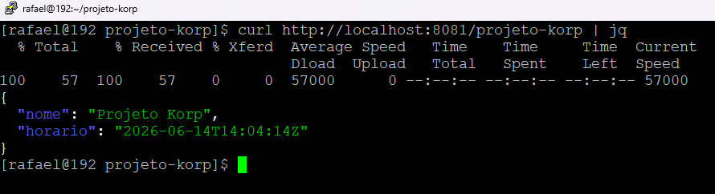
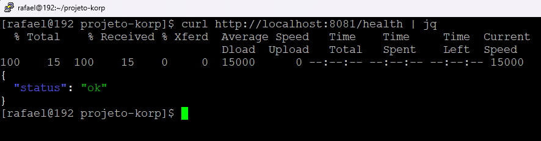
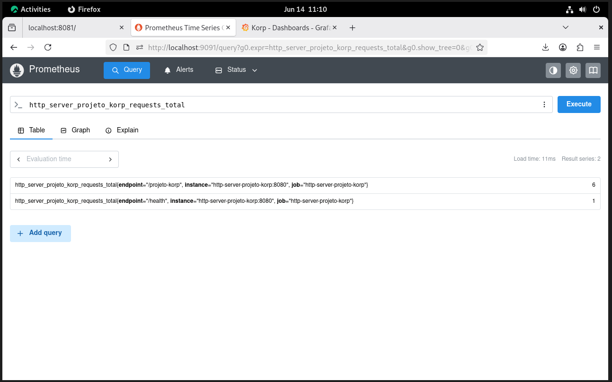
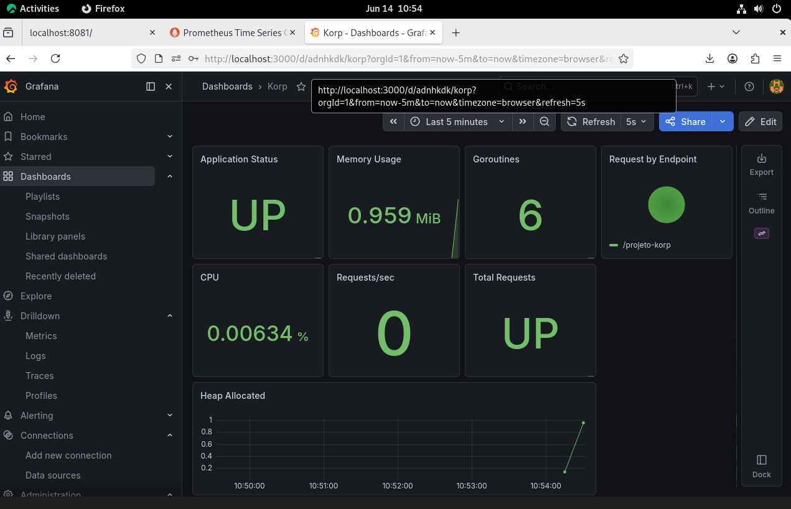

# http-server-projeto-korp

## Descrição

Serviço HTTP desenvolvido em Golang para o desafio técnico da Korp.

A aplicação disponibiliza endpoints para consulta da aplicação, health check e métricas Prometheus, executando em containers com Nginx como reverse proxy e monitoramento através de Prometheus e Grafana.

---

## Requisitos Atendidos

* Servidor HTTP em Golang
* Endpoint GET `/projeto-korp`
* Endpoint GET `/health`
* Endpoint GET `/metrics`
* Execução em containers
* Reverse Proxy com Nginx
* Monitoramento com Prometheus
* Dashboard Grafana
* Automação completa com Ansible

---

## Tecnologias Utilizadas

* Golang
* Nginx
* Prometheus
* Grafana
* Docker / Podman
* Docker Compose / Podman Compose
* Ansible

---

## Funcionalidades

* Endpoint principal `/projeto-korp`
* Endpoint de saúde `/health`
* Exposição de métricas Prometheus `/metrics`
* Reverse Proxy com Nginx
* Monitoramento com Prometheus
* Dashboard Grafana
* Provisionamento automatizado com Ansible

---

## Requisitos

* Go 1.23+
* Docker ou Podman
* Docker Compose ou Podman Compose
* Ansible

---

## Estrutura do Projeto

```text
.
├── app
│   ├── Dockerfile
│   ├── go.mod
│   ├── go.sum
│   └── main.go
├── nginx
│   └── conf.d
│       └── http-server-projeto-korp.conf
├── prometheus
│   └── prometheus.yml
├── grafana
├── ansible
│   ├── inventory.ini
│   ├── site.yml
│   └── roles
├── docs
│   └── evidencias
├── docker-compose.yml
└── README.md
```

---

## Arquitetura

```text
Cliente
   │
   ▼
Nginx (8081)
   │
   ▼
Aplicação Go (8080)
   │
   ├── /projeto-korp
   ├── /health
   └── /metrics
            │
            ▼
      Prometheus
            │
            ▼
         Grafana
```

---

## Endpoints

| Endpoint      | Método | Descrição                        |
| ------------- | ------ | -------------------------------- |
| /projeto-korp | GET    | Retorna informações da aplicação |
| /health       | GET    | Endpoint de verificação de saúde |
| /metrics      | GET    | Métricas Prometheus              |

---

## Exemplo de Retorno

### GET /projeto-korp

```json
{
  "nome": "Projeto Korp",
  "horario": "2026-06-14T13:53:43Z"
}
```

### GET /health

```json
{
  "status": "ok"
}
```

---

## Deploy Rápido

### Docker

```bash
docker compose up -d
```

### Podman

```bash
podman-compose up -d
```

Serviços disponíveis:

* http://localhost:8081/projeto-korp
* http://localhost:8081/health
* http://localhost:8081/metrics
* http://localhost:9091
* http://localhost:3000

---

## Testes

### Endpoint principal

```bash
curl http://localhost:8081/projeto-korp
```

### Health Check

```bash
curl http://localhost:8081/health
```

### Métricas

```bash
curl http://localhost:8081/metrics
```

### Consulta Prometheus

```bash
curl -s 'http://localhost:9091/api/v1/query?query=up'
```

---

## Métricas Customizadas

A aplicação exporta a métrica:

```text
http_server_projeto_korp_requests_total
```

Labels utilizadas:

* endpoint
* method
* status

Esta métrica é utilizada para monitoramento e construção dos painéis do Grafana.

---

## Monitoramento

### Prometheus

```text
http://localhost:9091
```

### Grafana

```text
http://localhost:3000
```

Credenciais padrão:

```text
Usuário: admin
Senha: admin
```

---

## Dashboard Grafana

O dashboard disponibiliza:

* Status da aplicação
* Uso de memória
* Uso de CPU
* Heap da aplicação
* Quantidade de goroutines
* Total de requisições
* Requisições por segundo
* Distribuição de requisições por endpoint

O Grafana é provisionado automaticamente através dos arquivos de provisionamento do projeto, dispensando importação manual após o deploy.

---

## Automação com Ansible

O ambiente pode ser provisionado automaticamente utilizando Ansible.

O playbook realiza:

* Instalação do Docker ou Podman
* Criação da rede de containers
* Build da aplicação
* Deploy dos containers
* Configuração do Nginx
* Configuração do Prometheus
* Provisionamento do Grafana
* Validação da aplicação através de requisição HTTP

Execução:

```bash
ansible-playbook -i inventory.ini site.yml
```

---

## Evidências

### Endpoint /projeto-korp



### Endpoint /health



### Consulta Prometheus


### Targets Prometheus



### Dashboard Grafana



### Execução e Validação via Ansible


---

## Validação do Ambiente

Após a execução do Docker Compose ou do Playbook Ansible:

| Serviço      | URL                                |
| ------------ | ---------------------------------- |
| Aplicação    | http://localhost:8081/projeto-korp |
| Health Check | http://localhost:8081/health       |
| Prometheus   | http://localhost:9091              |
| Grafana      | http://localhost:3000              |

---

## Autor

Rafael Rosa

Analista de Infraestrutura | Linux | Containers | Automação | Observabilidade

Projeto desenvolvido para o processo seletivo da Korp.

